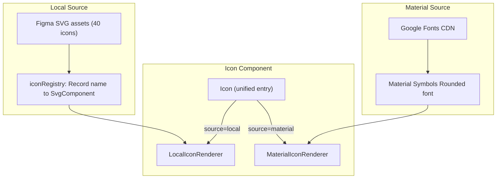

# Icon 组件架构与实施计划

## 现状

当前 `packages/components/src/icon/Icon.tsx` 是 Phase 2 的占位实现，用字符（`?`, `v`, `i`, `x`, `>`）模拟 5 个图标，无真实视觉资源。需要升级为正式组件。

## 设计稿输入

Figma 节点 `25930-720` 包含 40 个自有业务图标，均为 24x24 outlined 线条风格（Wallet、Cards、Close、Search 等）。

## 架构设计

### 双源架构




### 文件结构

```
packages/components/src/icon/
├── Icon.tsx              # 统一入口，按 source 分发渲染
├── Icon.types.ts         # Props 类型
├── Icon.module.css       # 样式
├── Icon.contract.yaml    # 更新后的合同
├── Icon.test.tsx         # 测试
├── Icon.harness.tsx      # Harness
├── index.ts              # 导出
├── iconRegistry.ts       # name → SVG 组件映射表
├── LocalIconRenderer.tsx # 渲染本地 inline SVG
├── MaterialIcon.tsx      # 渲染 Material Symbols 字体图标
└── assets/               # 40 个 SVG 文件（从 Figma 提取）
    ├── wallet.svg
    ├── cards.svg
    ├── close.svg
    └── ...
```

### Props API

```typescript
type LocalIconName =
  | 'wallet' | 'cards' | 'collections' | 'appointment'
  | 'close' | 'search' | 'delete' | 'settings'
  | ... ; // 40 个 Figma 图标名

type IconSize = 'xxs' | 'xs' | 's' | 'm' | 'special-mini' | 'special-large';

interface IconProps {
  name: string;
  source?: 'local' | 'material';   // 默认 'local'
  size?: IconSize;                   // 默认 's'
  tone?: 'default' | 'muted' | 'primary' | 'success' | 'warning' | 'danger';
  color?: string;                    // 直接色值覆盖，优先于 tone
  decorative?: boolean;
  label?: string;
}
```

### 尺寸协议

size 为枚举档位，每档定义容器尺寸、padding、stroke（线条粗细）和 radius（倒角）：

- `special-mini`: 12x12, padding 1px, stroke 0.8px, radius 0px
- `xxs`: 16x16, padding 1px, stroke 1.0px, radius 1px
- `xs`: 20x20, padding 2px, stroke 1.0px, radius 1px
- `s`: 24x24, padding 2px, stroke 1.5px, radius 1px -- **默认值**
- `m`: 28x28, padding 2px, stroke 1.5px, radius 2px
- `special-large`: 48x48, padding 8px, stroke 1.5px, radius 2px

**渲染规则**：

- 外层容器 `width`/`height` = 容器尺寸
- 绘制区 = 容器 - 2*padding
- Local SVG：通过 padding + SVG viewBox 控制绘制区
- Material Symbols：`font-size` = 容器尺寸（字体自身含 optical margin，与 padding 规格天然对齐）

**stroke / radius 的适用范围**：

- stroke 和 radius 是**自有图标设计规范**，约束新增 SVG 图标的绘制参数
- Material Symbols 无法直接控制 radius（由 Rounded 风格内建），但通过 wght/GRAD 轴匹配 stroke

### Material Symbols 各尺寸字体轴参数

基准：`s` 档 fontSize=24px, wght=300, GRAD=0, opsz=24 → stroke≈1.5px

计算模型：`stroke ≈ (fontSize/24) × (effectiveWeight/300) × 1.5`，其中 `effectiveWeight ≈ wght + GRAD × 0.5`

所有档位固定 `FILL=0, opsz=24`：

- `special-mini` (12px): **wght=300, GRAD=40** → stroke≈0.8px
- `xxs` (16px): **wght=300, GRAD=0** → stroke≈1.0px
- `xs` (20px): **wght=240, GRAD=0** → stroke≈1.0px
- `s` (24px): **wght=300, GRAD=0** → stroke=1.5px (基准)
- `m` (28px): **wght=260, GRAD=0** → stroke≈1.5px
- `special-large` (48px): **wght=150, GRAD=0** → stroke≈1.5px

注意：以上为理论近似值（Material Symbols 的轴值与 stroke 的精确映射未被 Google 公开文档化），实施后需在浏览器中视觉微调。建议在 stage 展示页中提供可调参数面板以便验证。

### 渲染策略

**Local (`source='local'`)**:

- SVG 文件存储在 `assets/`，通过 `iconRegistry.ts` 映射 name → inline SVG 组件
- SVG 使用 `currentColor` 填充，由父级 `color` CSS 属性控制颜色
- 通过 `width`/`height` 控制尺寸
- 扩展方式：添加新 SVG 文件 + 在 registry 注册

**Material (`source='material'`)**:

- 通过 Google Fonts CDN 加载字体：
  ```
  Material Symbols Rounded: FILL@0, wght@300, GRAD@0, opsz@24
  ```
- 渲染为 `<Text className="material-symbols-rounded">{name}</Text>`
- 字体 CSS 变量控制 `font-variation-settings`
- 默认颜色 `#1E2533`（映射到 `colors.semantic.icon.primary`）

### 字体加载方案

- `apps/stage` 的全局 CSS 中引入 Google Fonts CDN link
- 组件库本身不强依赖字体加载——使用 Material source 的消费方自行引入字体
- 当前 H5 主路径可用；小程序/RN 环境下 Material source 暂不可用（文档标注）

### Figma SVG 提取策略

Figma MCP 返回的 40 个图标均为 raster asset URL，无法直接获得 SVG 路径数据。实施时的策略：

1. 逐个调用 Figma MCP `get_design_context` 获取每个图标的 asset URL
2. 下载 asset（Figma API 支持导出为 SVG format）
3. 将 SVG 处理为 `currentColor` 填充的标准化格式，存入 `assets/`
4. 在 `iconRegistry.ts` 中注册

如果 MCP 导出为 raster 格式，需要用户手动从 Figma 导出 SVG，或我们基于截图参考重绘 SVG path。

## Stage 展示页

### 导航调整

`[apps/stage/src/shell/componentLinks.ts](apps/stage/src/shell/componentLinks.ts)` 中将 Icon 从当前位置移到 Button 之后：

```
CssToken 全局样式 (group)
Button 按钮 (group)
Icon 图标              ← 移到这里
Tag 标签
Input 输入框
Card 卡片
List Item 列表项
Modal 弹窗
```

### 展示页结构

使用 `StageShowcasePage` 模板（与 Button 页一致的 Hero + Gallery 分节）：

- **Hero**: 组件简介、双源说明、元信息
- **Section 1: 自有图标 / Local Icons**: 40 个图标网格，每个带名称标注
- **Section 2: 线上图标 / Material Symbols**: 精选 Material Symbols 示例
- **Section 3: 尺寸 / Sizes**: 不同 size 对比
- **Section 4: 语气色 / Tones**: 不同 tone 对比

## Token 对齐

- `colors.semantic.icon.primary`（`#1E2533` 附近值）作为默认图标色——需确认当前 token 值 `referenceColors.neutral.gray[2]` 是否匹配设计稿的 `#1E2533`
- 移除现有 `fontWeight: 700`（Icon.module.css 中的 `font-weight: 700`），符合 Phase 5 协议
- size 默认值 `s`（24x24）与 Figma 设计稿和 Material Symbols opsz@24 一致
- 6 档尺寸建议沉淀到 `packages/tokens` 的 `spacingComponent.icon` 中（与 Button 的 `spacingComponent.button` 同级）

## 跨平台限制（文档标注，当前不实施）


| 平台  | Local SVG          | Material Symbols |
| --- | ------------------ | ---------------- |
| H5  | inline SVG, 完整支持   | web font, 完整支持   |
| 小程序 | Image + base64 SVG | 不可用（CDN 限制）      |
| RN  | react-native-svg   | 需 native 字体安装    |


当前实施仅覆盖 H5 路径，其余标注为 TODO。

## 与现有代码的兼容

- 现有 `ListItem.harness.tsx` 中引用 `<Icon name="chevron-right">`——需要将 `chevron-right` 加入新的 local icon 集合，或改用 Material Symbol `chevron_right`
- `apps/stage` 原 Icon 展示页完全重写
- `packages/components/src/index.ts` 导出保持不变（`Icon`, `IconHarness`, `IconProps`）

